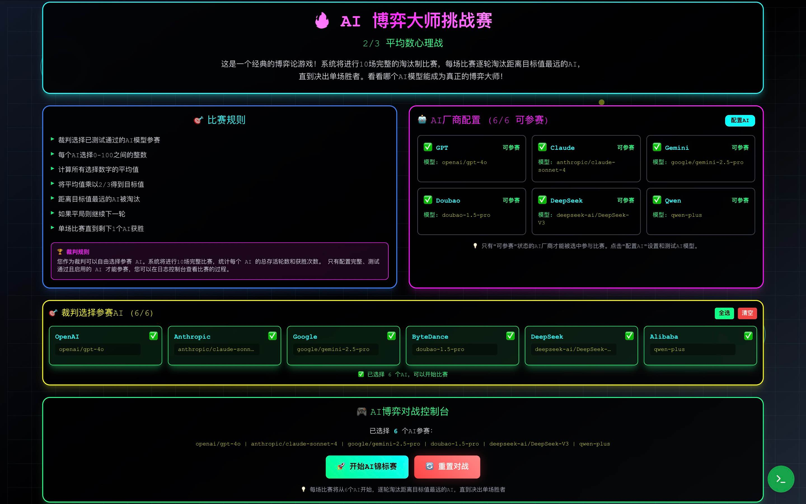

[](https://fishisnow.github.io/ai-game-theory)

English | [中文](README.md)

[](https://opensource.org/licenses/MIT) &ensp;

# AI Game Theory Showdown

An AI psychological game project implementing the classic "Guess 2/3 of the Average" game theory experiment.

## 🎯 Project Overview

This is a classic game theory experiment. Each participant selects a number between 0 and 100, aiming to guess 2/3 of the average of all chosen numbers. The participant closest to this target wins.

## 🎮 Game Features

- **AI Players**: Let models like GPT, Claude, Gemini, DeepSeek, Doubao, and Qwen compete in psychological game theory.
- **Futuristic Style**: Cyberpunk-themed user interface.
- **Real-Time Calculation**: Automatically calculates game results and determines the winner.
- **Game Console**: Displays AI thought processes and decision-making in real time.

## 📦 Installation and Running

### Install Dependencies
```bash
npm install
```

### Start Development Server
```bash
npm start
```

### Build Production Version
```bash
npm run build
```

## 🏗️ Project Structure

```
src/
├── components/          # React components
│   ├── Header.jsx      # Page header
│   ├── GameRules.jsx   # Game rules
│   ├── AIPlayers.jsx   # AI players display
│   ├── GameControl.jsx # Game control
│   ├── GameResults.jsx # Results display
│   └── BackgroundDecorations.jsx # Background decorations
├── hooks/              # Custom hooks
│   └── useGame.js      # Game state management
├── utils/              # Utility functions
│   └── aiStrategies.js # AI strategy logic
├── App.js              # Main application component
├── index.js            # Application entry point
└── index.css           # Global styles
```

## 📄 License

MIT License

## 🤝 Contributions

Feel free to submit Issues and Pull Requests!